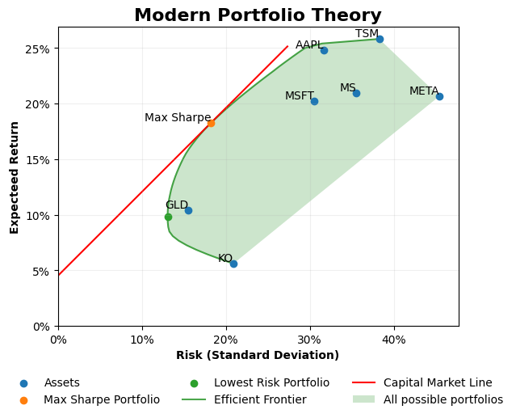

# Modern Portfolio theory

Modern Portfolio Theory (MPT) was introduced by [Harry Markowitz](https://en.wikipedia.org/wiki/Harry_Markowitz) in 1952. MPT is a mathematical investment framework that allows investors to optimise their allocation of assets using the mean returns as a proxy for expected return and the variance of those returns as a measure of risk (Mean-Variance model).

Portfolios which sit on the Efficient Frontier offer the best return for a given level of risk. The convex nature of the Efficient Frontier also means that some portfolios on the efficient frontier can offer a **higher** return for the **same** level of risk.

The Efficient Frontier also demonstrates that risk can be **decreased** by **increasing** the number of investments AND **increase** the return compared to a single asset. 

The Capital market line is tangent to the portfolio with the highest Sharpe and intersects at the risk free rate on the y axis.

```math
R_e=(\text{Sharpe Ratio}\times \sigma) + R_f
```

On this line the most capital efficient portfolio can be levered by shorting the risk free rate (borrowing) and using those funds to purchase more of the efficient portfolio to increase returns (and risk). On this line it is also possible to lower your risk (and returns) by selling the assets to invest a portion into the risk free rate.



